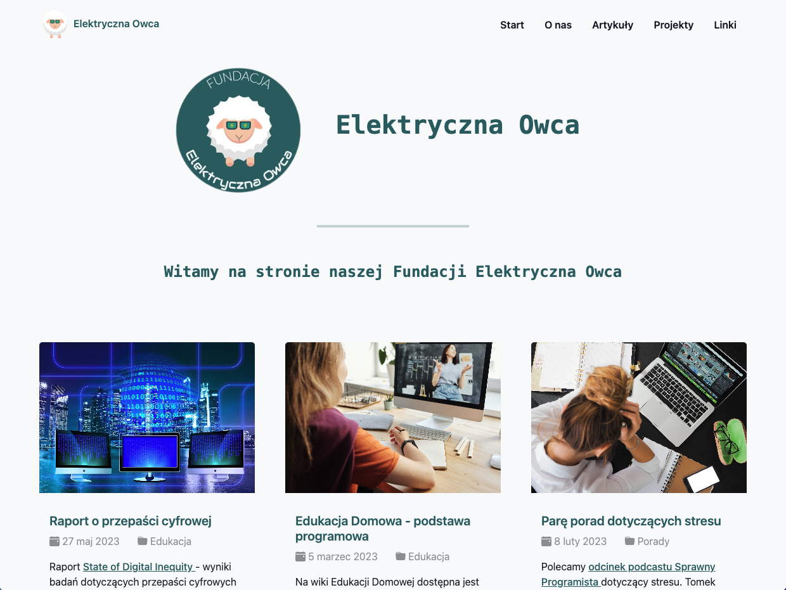

# "Elektryczna owca" website - commercial project 

Website featuring articles on studying and technologies. Crafted the design personally in Figma. Developed the website using HTML, CSS, JavaScript and Bootstrap v5.3. Generated some imagines via Midjourney.

### Links - live preview

- Website: [https://elektryczna-owca-basiakedz.netlify.app/](https://elektryczna-owca-basiakedz.netlify.app/)
- Form: [https://elektryczna-owca-basiakedz.netlify.app/form](https://elektryczna-owca-basiakedz.netlify.app/form)

### Built with

- **Semantic HTML**: Structuring the app's user interface.
- **CSS**: Styling the app's appearance.
- **Bootstrap v5.3**: Enhancing the app's appearance.
- **Vanilla JavaScript**: Dynamically generating a list of radio buttons with labels representing dates and times within a form.

### How to Use

1. Clone this repository to your local machine.
2. Open the `index.html` file in a web browser.
3. Explore the entire website to discover its features and content.

